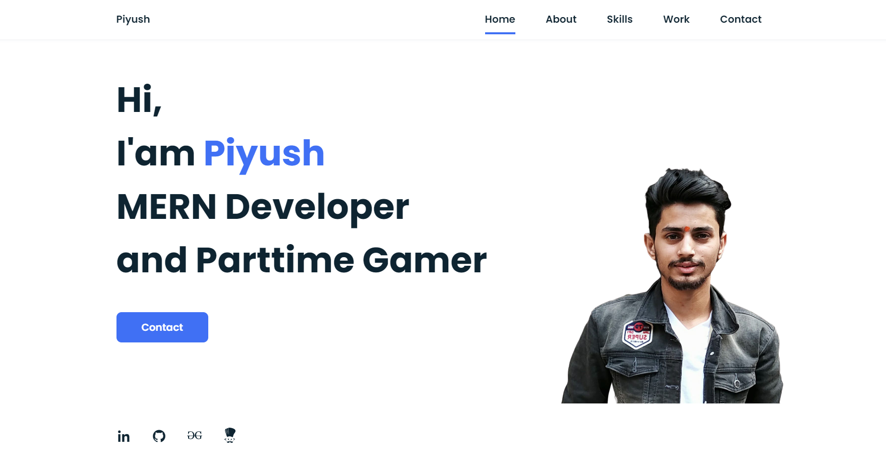
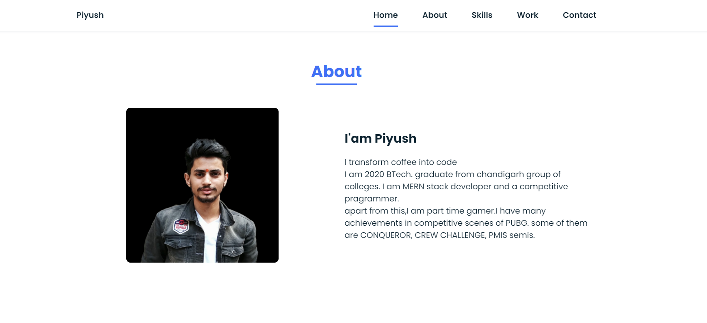
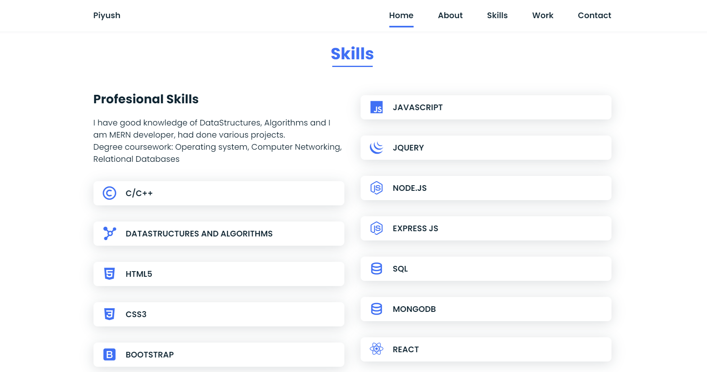
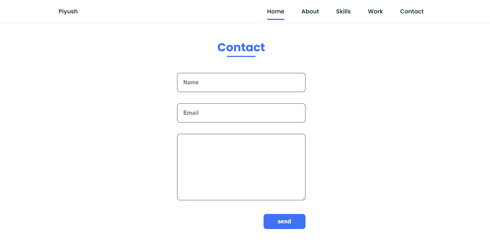

# Portfolio Responsive Complete
### Portfolio responsive complete
A clean and nice web [portfolio][website] for designer or developer. That includes almost everything you want to show. At first, your name, links to social networks and a great image. Then the About section displays more information about you. Then the list of Skills it offers. It also has a section where it shows some recent work. And at the bottom it has a form, and at the end with a footer.
## visit my [portfolio][website] here 

 
 

[website]:https://piyush-pp.github.io/piyush-portfolio/

